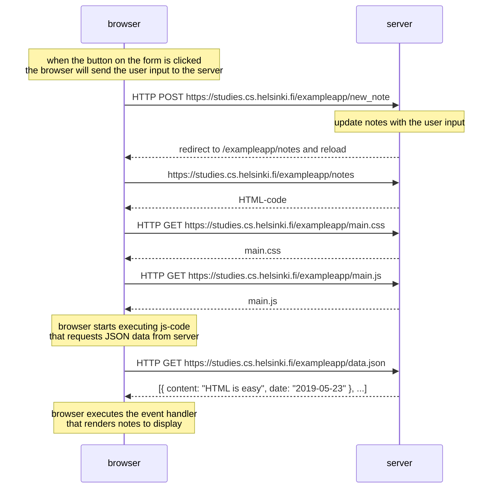

```mermaid
sequenceDiagram
Note over browser: when the button on the form is clicked <br/> the browser will send the user input to the server

browser->>server: HTTP POST https://studies.cs.helsinki.fi/exampleapp/new_note

Note over server: update notes with the user input

server-->>browser: redirect to /exampleapp/notes and reload
browser->>server: https://studies.cs.helsinki.fi/exampleapp/notes
server-->>browser: HTML-code
browser->>server: HTTP GET https://studies.cs.helsinki.fi/exampleapp/main.css
server-->>browser: main.css
browser->>server: HTTP GET https://studies.cs.helsinki.fi/exampleapp/main.js
server-->>browser: main.js

Note over browser: browser starts executing js-code <br/>that requests JSON data from server 

browser->>server: HTTP GET https://studies.cs.helsinki.fi/exampleapp/data.json
server-->>browser: [{ content: "HTML is easy", date: "2019-05-23" }, ...]

Note over browser: browser executes the event handler <br/>that renders notes to display

```
