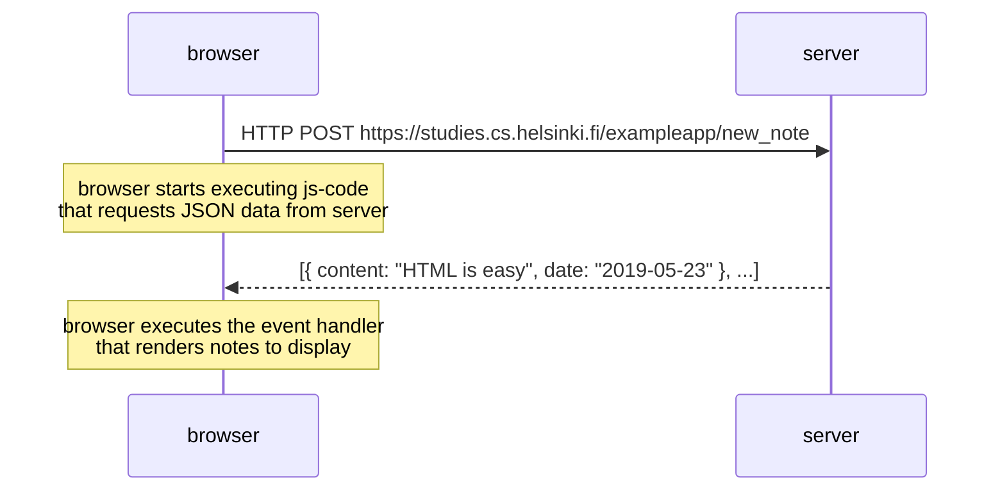

```mermaid
sequenceDiagram
browser->>server: HTTP POST https://studies.cs.helsinki.fi/exampleapp/new_note
Note over browser: browser starts executing js-code <br/>that requests JSON data from server 
server-->>browser: [{ content: "HTML is easy", date: "2019-05-23" }, ...]
Note over browser: browser executes the event handler <br/>that renders notes to display

```
