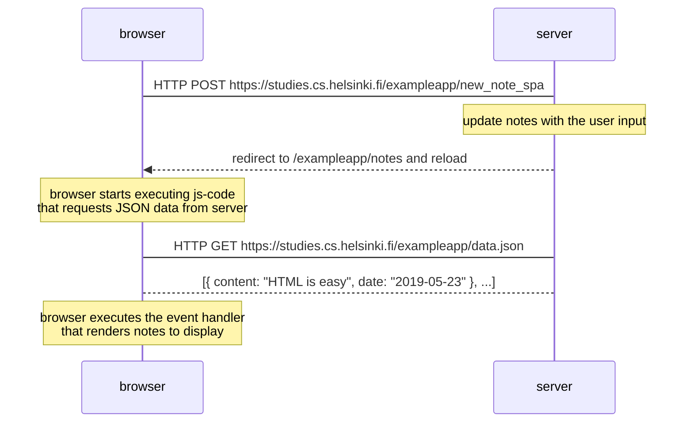

```mermaid
sequenceDiagram

browser->server: HTTP POST https://studies.cs.helsinki.fi/exampleapp/new_note_spa
Note over server: update notes with the user input

server-->>browser: redirect to /exampleapp/notes and reload

note over browser: browser starts executing js-code<br>that requests JSON data from server 

browser->server: HTTP GET https://studies.cs.helsinki.fi/exampleapp/data.json
server-->browser: [{ content: "HTML is easy", date: "2019-05-23" }, ...]

note over browser: browser executes the event handler<br>that renders notes to display

```
